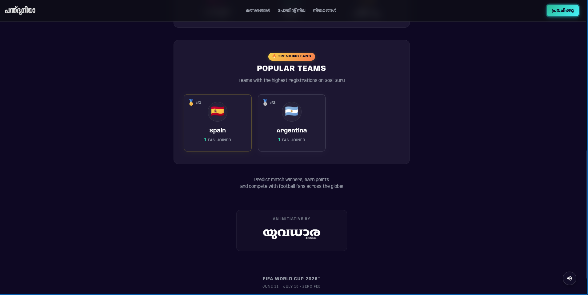
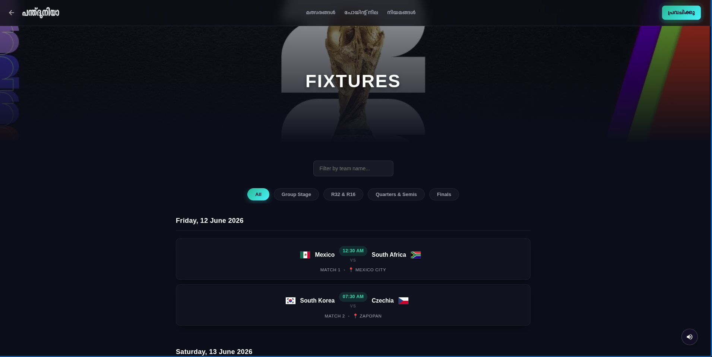
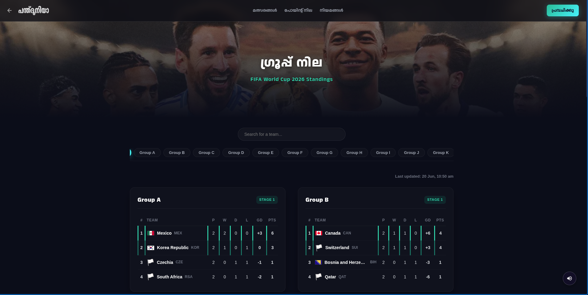
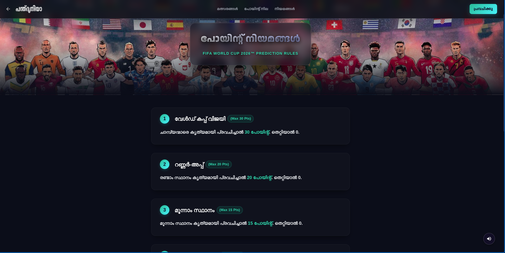
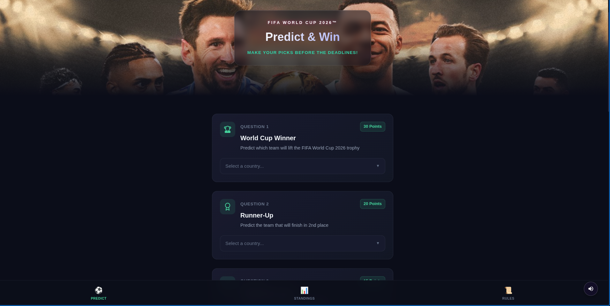

# PanthDuniya
**FIFA World Cup 2026 Prediction Platform** — Built for Keralites.

Predict 6 Key Questions, earn points per correct pick, and climb the global leaderboard to win exciting prizes.

---

## UI Preview

Here is a glimpse of the Goal Guru platform:

### 1. Landing Page


### 2. Popular Teams


### 3. Fixtures Schedule


### 4. Group Standings


### 5. Prediction Rules


### 6. Predict & Win


---

## Tech Stack

| Layer | Technology |
|---|---|
| Framework | Next.js 14 (App Router, TypeScript) |
| Auth & Database | Supabase (PostgreSQL) |
| Match Data | API-Football v3 |
| Cron Jobs | cron-job.org (external trigger) & Vercel Functions |
| Analytics | Meta Pixel (Facebook Pixel) |
| Hosting | Vercel |

---

## Environment Setup

Copy `.env.example` to `.env.local` and fill in your values:

```bash
cp .env.example .env.local
```

### Required Variables

| Variable | Description |
|---|---|
| `NEXT_PUBLIC_SUPABASE_URL` | Supabase Project URL |
| `NEXT_PUBLIC_SUPABASE_ANON_KEY` | Supabase Anonymous Client Key |
| `SUPABASE_SERVICE_ROLE_KEY` | Supabase Service Role Key (for admin tasks) |
| `FOOTBALL_API_KEY` | API-Football v3 key (for match data) |
| `FOOTBALL_API_HOST` | API-Football v3 host URL |
| `CRON_SECRET` | Secret string to authenticate cron-job.org requests |

---

## Getting Started

```bash
# Install dependencies
npm install

# Start dev server
npm run dev
```

Visit [http://localhost:3000](http://localhost:3000)

---

## Architecture

### Core Pages
- `/` — Landing page with live popular/trending teams.
- `/(auth)/register` — Custom registration flow (capturing email, phone, pincode, district, and favourite team).
- `/(app)/predict` — The main 6-question prediction form. Users can only submit once.
- `/results` — Live Group Standings with search and filter capabilities.
- `/fixtures` — Complete match schedule grouped by stage (Group Stage, Round of 32, etc.).

### Database (Supabase PostgreSQL)
Key tables powering the application:
- `users` (extended profile metadata)
- `group_standings` (live updated standings)
- `favourite_teams` (used to calculate popular team leaderboard)
- `predictions` (stores user answers to the 6 questions)

### Standings Automation
- Standings are synchronized from API-Football via the `/api/cron/update-standings` endpoint.
- Since Vercel Hobby limits cron jobs to 1 per day, the endpoint is triggered every 4 hours automatically using **cron-job.org**.

### Scoring & Predictions
- Users predict 6 key outcomes: World Cup Winner, Runner-Up, Semi-Finalists, etc.
- Different point weights apply to each question (e.g., 30 pts for Winner, 20 pts for Runner-Up).
- Submissions are permanently locked once completed per phone number / email.

---


## Deployment

1. Push to GitHub
2. Connect to Vercel — import this repo
3. Set all environment variables in Vercel Dashboard
4. Vercel auto-detects Next.js and deploys

After first deployment:
1. Register on the live site
2. Copy your Firebase UID from Firestore → set `ADMIN_UID` in Vercel env vars
3. Redeploy to activate admin access

---

## Design System

Premium Dark Theme with Glassmorphism:
- **Backgrounds**: `#0a0e1a` (Deep Night), `#1a1f35` (Cards)
- **Accents**: Mint Green (`#34d399`), Hot Pink (`#ec4899`), Gold (`#f59e0b`)
- **Fonts**: 
  - *Outfit* & *Inter* for modern English UI.
  - *Anek Malayalam* & *Noto Sans Malayalam* for native localizations.
- **Visuals**: Dynamic gradient glows, box shadows, and flagcdn integration.

---

## License

MIT — Built with ❤️ for the beautiful game.
